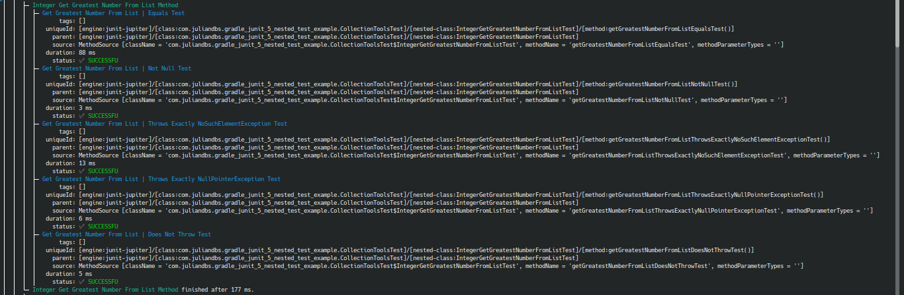
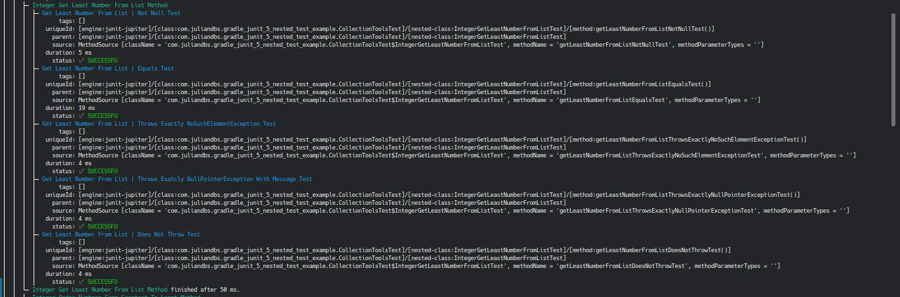

# Gradle - JUnit 5 Nested Test Example
> Testing JUnit 5 Nested Tests

## Table of Contents
* [Technologies Used](#technologies-used)
* [Screenshots](#screenshots)
* [Setup Linux](#setup-linux)
* [Usage Linux](#usage-linux)
* [Contact](#contact)

## Technologies Used
- Gradle - version 7.4.2
- Java - version 11
- JUnit - version 5.8.1
- JUnit platform console standalone - version 1.9.0-M1
- Nano - version 5.2

## Screenshots





## Setup Linux
> Extracted from https://mkyong.com/junit5/junit-5-consolelauncher-examples/

0. Clone the GitHub repository.
1. Download the last version of ['junit-platform-console-standalone.jar'](https://repo1.maven.org/maven2/org/junit/platform/junit-platform-console-standalone/) from the Maven Central repository.


2. Put the 'junit-platform-console-standalone-1.9.*.jar' in the main project directory.

## Usage Linux
0. Open a Terminal.
1. Go to the main project directory.
2. Run the following command :
```
	$ java -jar junit-platform-console-standalone-1.9.0-M1.jar -cp ./app/build/classes/java/test/:./app/build/classes/java/main/ --select-package='com.juliandbs.gradle_junit_5_nested_test_example' --details=verbose
``` 

## Contact
Created by [@_julian_dbs](https://twitter.com/_julian_dbs)
